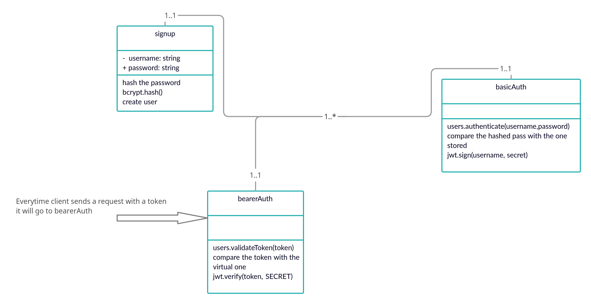

# bearer-auth
re-authenticate users to shield access to any route that requires a valid login to access.

instructor notes: token is a virtual field that isn't store in the DB and we generate it when the user logs in successfully. then we use bearer token to verify their token everytime they send a request.

pull request: https://github.com/nour-alsatari/bearer-auth/pull/1     
heroku app:  
UML: 

